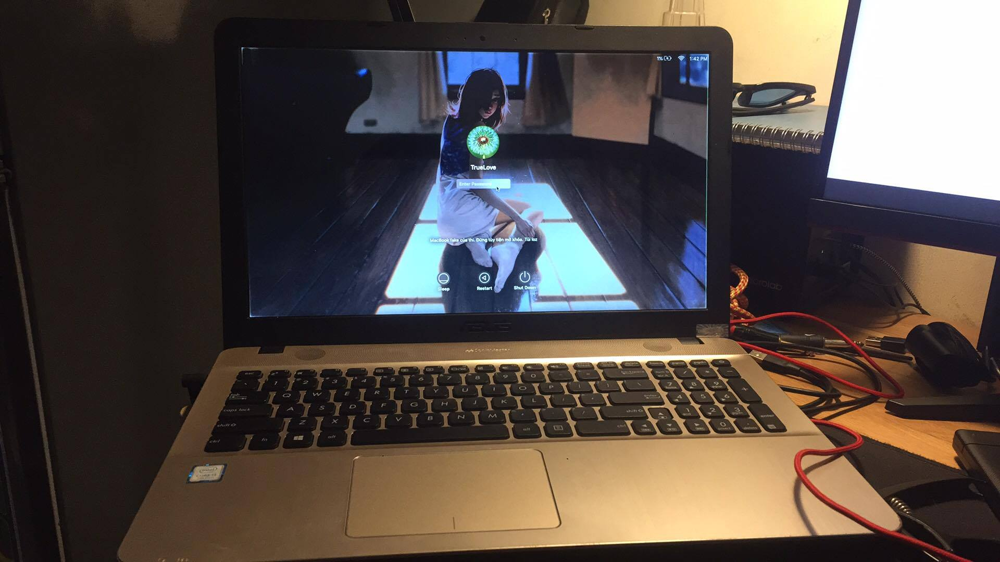

# Pick up Hackintosh Guide/ Asus x541UAK
### Screenshot

### Notes
 - Tất cả mọi thứ đều hoạt động tốt.
 - Card wifi bluetooth stock đã thay thế nên chỉ dùng được Wifi
 - Sau khi cài Clover sẽ bị đen màn khi ấn F2 vào Bios

### Cấu hình :
 - Intel i3-7100U CPU
 - Intel HD Graphics 620 
 - Broadcom BCM94322HM8L WIFI (DW1510)
 - 4GB 2133MHz DDR4 RAM
 - 15.6” HD (1366x768) Display
 - 120 GB SSD (Sata)

### Cài đặt Bios
 - Disable Secure Boot

# Tạo bộ cài

## Tạo bộ cài trên MacOS

- Tải xuống bộ cài MacOS Mojave từ các nguồn, đuôi dmg.
- Vất vào Applications rồi làm theo hướng dẫn tạo bộ cài lên USB bằng bài viết này:
https://blogchiasekienthuc.com/hackintosh/tao-usb-cai-hackintosh-voi-clover-bootloader.html

## Tạo bộ cài trên Windows

- Tải xuống bộ cài MacOS Mojave từ các nguồn, đuôi raw.
- Dùng thằng Etcher hoặc Win32 Disk Imager để ghi lên USB.
- Cá nhân mình dùng Etcher vì nó dễ dùng giao diện đẹp.

## Chuẩn bị EFI trên ổ cứng dể boot vào bộ cài từ USB

- Dùng win pe và sử dụng công cụ minitool partition wizard 12.
- Ổ cứng để địng dạng GPT
- Tạo phân vùng FAT32 tên EFI MAC = 210 MB
- Chuyển phân vùng thành EFI partition rồi Apply
- Copy toàn bộ EFI trên Github vào phân vùng vừa tạo.
- Tạo phân vùng NTFS, phân vùng này để Earse trong Disk Utility để cài Mac lên đây.

  
## Install

- Khởi động máy vào boot option (nếu có 1 EFI auto vào clover)
- Chọn UEFI phân vùng ở bước trên chúng ta tạo.
- Vào được Clover - chọn bộ cài từ USB và làm tiếp các bước cài đặt.  

## Credits
 - [Me](https://github.com/bjmbjm207)

